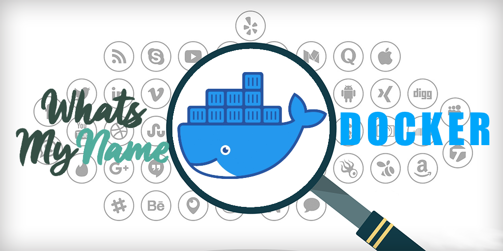

  

 <!-- GEN:Docker --><!-- GEN:stop -->

Version: 1.0.0

## 💎 About

[WhatsMyName (WMN)](https://github.com/WebBreacher/WhatsMyName) by [Micah "WebBreacher" Hoffman](https://webbreacher.com/) was created in 2015 with the goal of discovering usernames on a given website. WMN-Docker creates an API wrapper in a containerized Docker environment around WMN for integration, modularity, and scalability with other OSINT tooling.

## ✨ Features

WMN-Docker offers straightforward functionality to compliment the original intent of WMN while ensuring a basic level of security and bonus features.

- **JWT Authentication**
  - Optional, enabled by default
  - `/api/v1/token`
- **Username Lookup**
  - Initiate a username lookup across the web
  - `/api/v1/lookup`
- **Job Results**
  - Returns the results of username lookup
  - Results are cached for performance (default 1 hour)
  - `/api/v1/status/{job_id}`

## 🛠️ Getting Started

### Prerequisites

- Docker
- Docker-Compose
- Python 3.10

### Installation
**Clone the repository**
```bash
git clone https://github.com/kodamaChameleon/wmn-docker.git
cd wmn-docker
```

*(Optional)* Use a python virtual environment. Not necessary for launching the Docker API.
```bash
python3 -m venv .venv
source .venv/bin/activate
```

**Environment**
- **Quick Setup**: Initialize the local .env and pull container images from DockerHub using `python3 client.py --setup`
- **Contributing**: Initialize the local .env and build container from source code with `python3 client.py --setup dev`

> 💡 It is recommended to allow memory over commit for redis servers in production. Try `sysctl vm.overcommit_memory=1`

### Initialize User Database
By default, authentication is required. *If you wish to disble this requirement (not recommended for production environments), set AUTH_REQUIRED=False in your .env file.* To initialize the user database and retrieve credentials:
- Execute `docker ps` to obtain the container id of the api.
- Launch a bash shell with `docker exec -it <api_container_id> bash`
- Initialize the database by running `python3 users.py initialize`
- Save the initial credentials in a safe location.

> 💡 Additional user management features are available from the users.py command line utility inside the container. Just run `python3 users.py -h`

### Example Usage
The client.py sub-library, [api.py](utils/api.py), already contains an example python wrapper for API usage. Here are a few more examples to get you started using curl.

**Authentication**
```bash
curl -X POST "http://localhost:8000/api/v1/token" \
     -H "Content-Type: application/json" \
     -d '{"user_id": "your_user_id", "secret": "your_secret"}'
```
Returns a JSON Web Token (JWT) for use in subsequent calls.

**Submit a Username for Lookup**
```bash
curl -X POST "http://localhost:8000/api/v1/lookup" \
     -H "Authorization: Bearer your_jwt_token" \
     -H "Content-Type: application/json" \
     -d '{"username": "kodamachameleon"}'
```
Returns a Job ID to lookup results.

**Check Job Status**
```bash
curl -X GET "http://localhost:8000/api/v1/status/your_job_id" \
     -H "Authorization: Bearer your_jwt_token"
```
Returns JSON results of username lookup.

## 🤝Contributing
Contributions are welcome! Please read the [CONTRIBUTING.md](CONTRIBUTING.md) for details on how to get involved.

## 📜 License


[Creative Commons Attribution-ShareAlike 4.0 International License](http://creativecommons.org/licenses/by-sa/4.0/).
